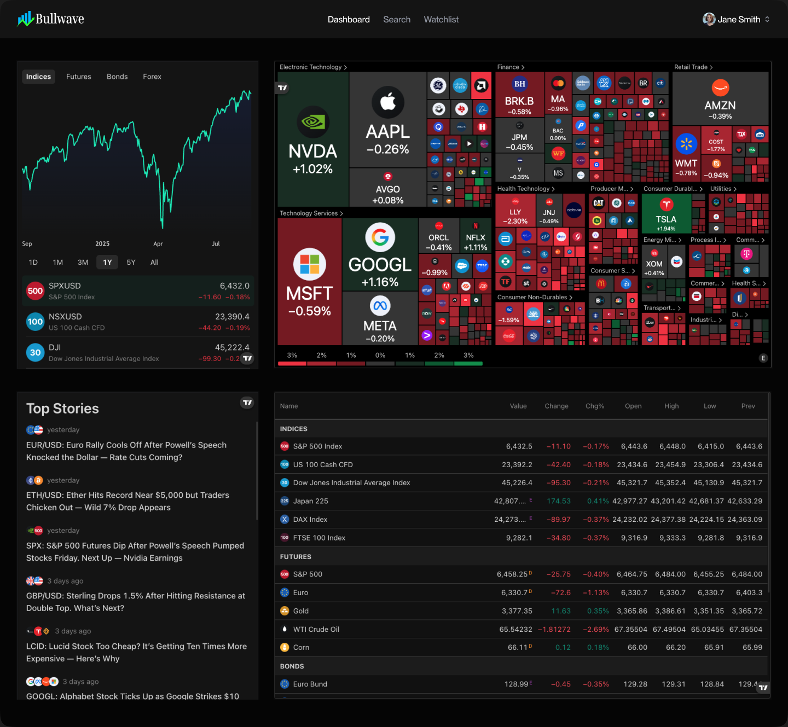

### 📈 BULLWAVE STOCK MARKET APP 📈

  

<h1 align="center">📈 Bullwave - Stock Market App</h1>

  <b>Alerts • Charts • AI Insights</b>  
   
  Build & Deploy a <b>Stock Market App</b> with modern tools — Real-time analytics, AI summaries, and automated alerts.

  
  
  
  
  
  
  
  

## 📋 Introduction
Bullwave - A modern stock market web build with NextJS, Shadcn, Better Auth and Inngest. Track real-time prices, set personalized alerts, explore company insights, and manage watchlists. The admin dashboard allows managing stocks, publishing news, and monitoring alerts, AI-driven daily digests, earnings notifications. 

## ⚙️ Tech Stack
**[Next.js](https://nextjs.org/)** - A powerful React framework for building full-stack web applications. It provides server-side rendering, static site generation, and API routes, allowing developers to create optimized and scalable apps quickly.

**[TypeScript](https://www.typescriptlang.org/)** - A statically typed superset of JavaScript that improves code quality, tooling, and error detection. It is ideal for building large-scale applications and enhances maintainability.

**[TailwindCSS](https://tailwindcss.com/)** - A utility-first CSS framework that allows developers to build custom, responsive designs quickly without leaving their HTML. It provides pre-defined classes for layout, typography, colors, and more.

**[Shadcn](https://ui.shadcn.com/)** - An open-source library of fully customizable, accessible React components. It helps teams rapidly build consistent, visually appealing UIs while allowing full control over design and layout.

**[MongoDB](https://www.mongodb.com/)** - A flexible, high-performance NoSQL database. It stores data in JSON-like documents, supports dynamic schemas, and provides robust features for scalability, replication, and querying.

**[Better Auth](https://www.better-auth.com/)** - A framework-agnostic authentication and authorization library for TypeScript. It provides built-in support for email/password login, social sign-on (Google, GitHub, Apple, and more), and multi-factor authentication, simplifying user authentication and account management.

**[Inngest](https://www.inngest.com/)** - A platform for event-driven workflows and background jobs. It allows developers to build reliable, scalable automated processes such as real-time alerts, notifications, and AI-powered workflows.

**[Finnhub](https://finnhub.io/)** - A real-time financial data API that provides stock, forex, and cryptocurrency market data. It offers developers access to fundamental data, economic indicators, and news, making it useful for building trading apps, dashboards, and financial analysis tools.

**[Nodemailer](https://nodemailer.com/)** - A Node.js library for sending emails easily. It supports various transport methods such as SMTP, OAuth2, and third-party services, making it a reliable tool for handling transactional emails, notifications, and contact forms in applications.

**[CodeRabbit](https://coderabbit.ai/)** - An AI-powered code review assistant that integrates with GitHub. It helps developers catch bugs, enforce best practices, and maintain consistent code quality across pull requests, reducing manual review effort and speeding up the development workflow.

## 🔋 Features
⚡**Stock Dashboard:** Track real-time stock prices with interactive line and candlestick charts, inclusing historical data, and filter stocks by industry, performance, or market cap.

⚡**Powerful Search:** Quickly find the best stocks with an intelligent search system that helps you navigate through Bullwave

⚡**Watchlist & Alerts:** Create a personalized watchlist, set alert thresholds for price changes or volume spikes, and receive instant email notifications to stay on top of the market.

⚡**Company Insights:** Explore detailed financial data such as PE ratio, EPS, revenue, recent news, filings, analyst ratings, and sentiment scores for informed decision-making.

⚡**Real-Time Workflows:** Powered by Inngest, automate event-driven processes like price updates, alert scheduling, automated reporting, and AI-driven insights.

⚡**AI-Powered Alerts & Summaries:** Generate personalized market summaries, daily digests, and earnings report notifications, helping users track performance and make data-driven decisions.

⚡**Customizable Notifications:** Fine-tune alerts and notifications based on user watchlists and preferences for a highly personalized experience.

⚡**Analytics & Insights:** Gain insights into user behavior, stock trends, and engagement metrics, enabling smarter business and trading decisions.